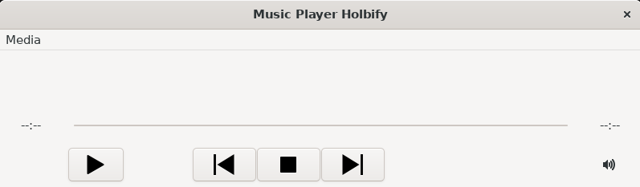
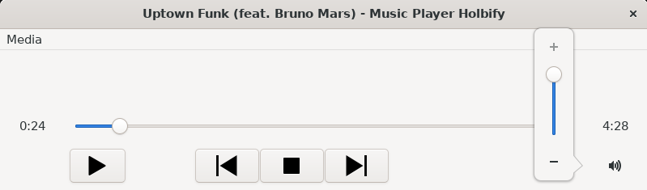
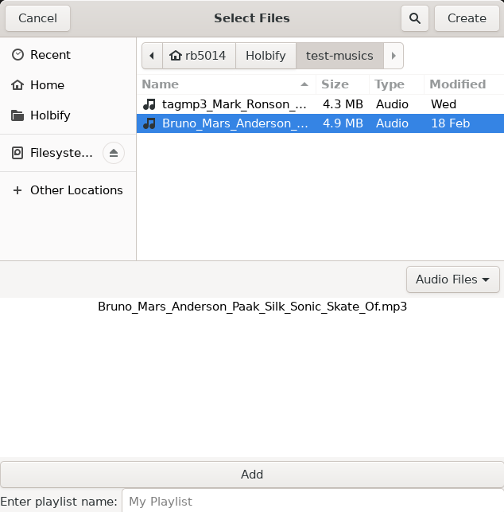
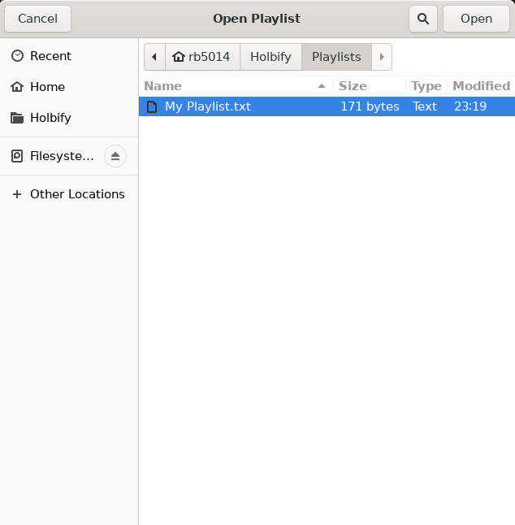

[Introduction](#introduction)

[Features](#features)

[About](#about)

# Introduction

Holbify is a music player withbasic features such as play/pause/stop a song, show song informations, go to next/previous song, change the volume of the program, create/open playlists...

Check out my [landing page](https://github.com/Holbify/web/index.html) for more information about my project!

<a href="https://youtu.be/rlmdrxb_77I" target="_blank">
    <button>View Demo</button>
</a>

## Features

### Play a song / Change volume / Show song information
The user by clicking on the Play button will either open a dialog to choose a file, or start again a song already loaded. Loading another song will send the previous one in a "Recent playlist", permitting the user to use the Previous/Next buttons.

### Create playlists
It is possible to create playlists, stored locally with the name of your choice!

### Open playlists
Play your best Bruno Mars playlist any time you want after you created it!

## About

This is a Portfolio Project for end of first year at [Holberton School](https://www.holbertonschool.fr/) by Romain Bayle.

This music player is inspired by :
- VLC media player
- Windows Media Player

Source repository:

My Linkedin profile:

