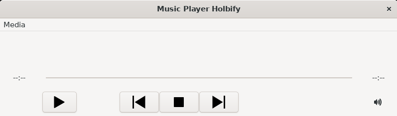
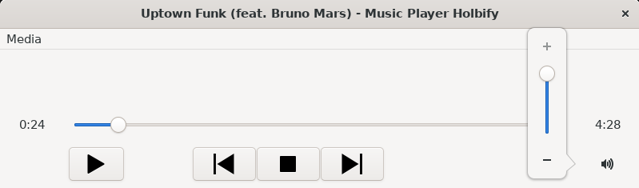
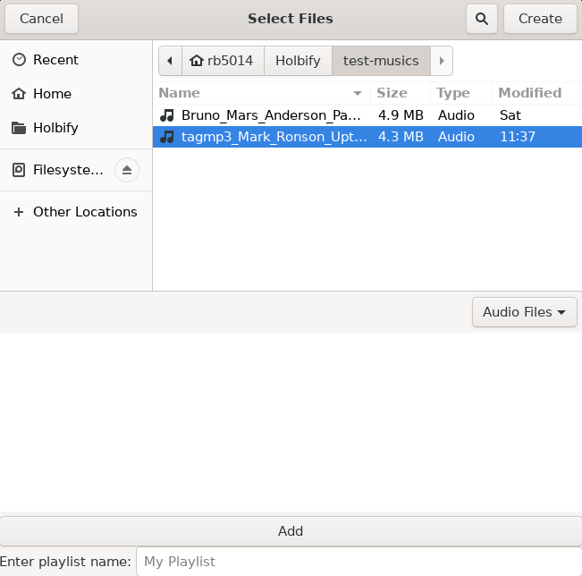

[Introduction](#Holbi Music Player)

[Features](#features)

[About](#about)

# Introduction

Lorem ipsum dolor sit amet, consectetur adipiscing elit. Vivamus at tincidunt nisl. Praesent vitae dictum lectus. Donec dignissim felis sollicitudin nibh feugiat tincidunt. Phasellus orci urna, pretium nec leo in, ultricies pretium odio. Maecenas sollicitudin mauris ornare ornare imperdiet. Sed efficitur odio quis sem euismod fringilla. Maecenas dui urna, maximus vitae risus sed, congue rutrum justo. Nunc ante metus, viverra nec sodales eget, pretium ut nunc.

<a href="https://youtu.be/rlmdrxb_77I" target="_blank">View Demo</a>

## Features

### Play a song / Change volume / Show song information
Lorem ipsum dolor sit amet, consectetur adipiscing elit. Vivamus at tincidunt nisl. Praesent vitae dictum lectus. Donec dignissim felis sollicitudin nibh feugiat tincidunt. Phasellus orci urna, pretium nec leo in, ultricies pretium odio. Maecenas sollicitudin mauris ornare ornare imperdiet. Sed efficitur odio quis sem euismod fringilla. Maecenas dui urna, maximus vitae risus sed, congue rutrum justo. Nunc ante metus, viverra nec sodales eget, pretium ut nunc.

### Create playlists
Lorem ipsum dolor sit amet, consectetur adipiscing elit. Vivamus at tincidunt nisl. Praesent vitae dictum lectus. Donec dignissim felis sollicitudin nibh feugiat tincidunt. Phasellus orci urna, pretium nec leo in, ultricies pretium odio. Maecenas sollicitudin mauris ornare ornare imperdiet. Sed efficitur odio quis sem euismod fringilla. Maecenas dui urna, maximus vitae risus sed, congue rutrum justo. Nunc ante metus, viverra nec sodales eget, pretium ut nunc.

## About

This is a Portfolio Project for end of first year at [Holberton School](https://www.holbertonschool.fr/) by Romain Bayle.

This music player is inspired by :
- VLC media player
- Windows Media Player

[Repository of this project](https://github.com/rb5014/Holbify)